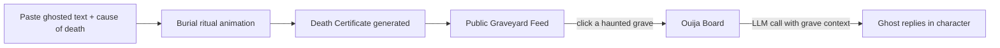

# Rest in Read 🪦

## Basic Details
### Team Name: Tinkerers

### Team Members
- Team Lead: Ajo Jose - College of Engineering Trivandrum (CET)
- Member 2: Deepa Mary Jose - College of Engineering Trivandrum (CET)

### Project Description
A digital graveyard for texts that got left on read. Bury your ghosted messages, get a death certificate for closure, mourn with others who lie next to you, and — if you're truly unwell — summon the ghost of the conversation on an interactive Ouija board.

### The Problem (that doesn't exist)
Nobody has built a proper funeral service for the text message that got "seen" and never replied to. Millions of unresolved "hey"s are out there, unburied, haunting people's chat threads with zero closure.

### The Solution (that nobody asked for)
A morgue intake form where you confess your ghosted text, a burial ritual that generates an official "Declaration of Closure" certificate, a communal graveyard of everyone else's tragic texts to mourn together, and a flirty, attention-starved AI ghost you can summon via Ouija board to ask it "why."

## View our site here: [https://leftonseen.netlify.app/]

## Technical Details
### Technologies/Components Used
For Software:
- TypeScript, JavaScript
- Next.js 14, React 18
- Tailwind CSS, Framer Motion
- Anthropic Claude API (ghost dialogue persona), with a local rule-based fallback when no API key is present
- Web Audio API (all sound effects are synthesized in-browser, zero audio files)
- Supabase (optional shared/communal graveyard — the app runs fully on localStorage without it)
- Netlify (deployment)

### Implementation
For Software:

# Installation
```bash
git clone https://github.com/AjoJosee/useless_project_temp.git
cd useless_project_temp
npm install
cp .env.example .env.local   # optional: add ANTHROPIC_API_KEY and Supabase keys for live ghost dialogue + shared graveyard
```

# Run
```bash
npm run dev
```
Then open http://localhost:3000

### Project Documentation
For Software:

# Screenshots


*Submitting a ghosted text with cause of death and time-of-death*


*Browsing everyone's buried texts as tombstones*


*Summoning the ghost of a dead conversation*

# Diagrams

*How a ghosted text moves from confession to closure to communal mourning to (optionally) paranormal flirting*

### Project Demo
# Video
[Add your demo video link here]
*Walkthrough of burying a text, browsing the graveyard, and summoning a ghost on the Ouija board*

# Additional Demos
[Add link to your pitch reel here, if separate from the demo video]

## Team Contributions
- Ajo Jose: Core app build — Next.js structure, Supabase/local storage layer, LLM-powered ghost dialogue integration
- Deepa Mary Jose: UX simplification, copy writing, VFX/SFX design, Ouija board correlation fixes, documentation

## AI Tools Disclosure
Per hackathon rules (section 3.2), AI tools were used and are disclosed here:
- **Claude** (via an agentic coding IDE) was used throughout development for implementation guidance, debugging, and code changes to the features described above.
- **Google Gemini** was used for a portion of development when Claude usage limits were reached mid-hackathon.
- **Anthropic's Claude API** is also a runtime dependency of the shipped product itself (not just a dev tool) — it powers the in-app Ouija ghost's contextual dialogue.
All AI-assisted changes were reviewed and tested by the team before being committed.

---
Made with ❤️ at TinkerHub Useless Projects


